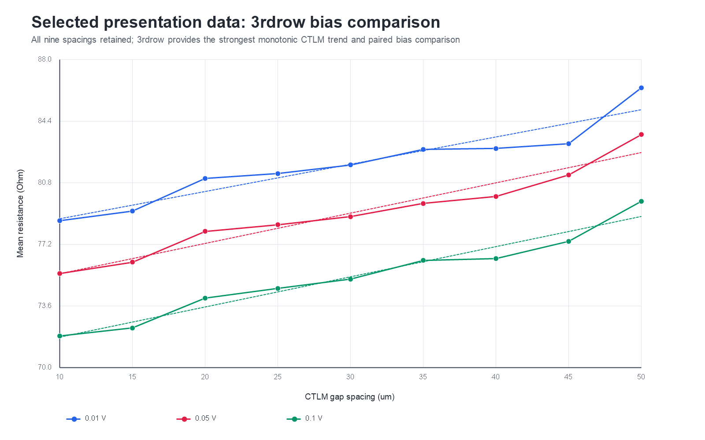

# W4 CTLM 측정 데이터 분석

반도체소자측정실험 4주차 CTLM 데이터를 일괄 처리하고, 간격별 저항 경향과 인가 전압 의존성을 분석하는 저장소입니다. 원본 CSV, 재현 가능한 PowerShell 분석 코드, 요약 CSV 및 발표용 PNG 그래프를 함께 제공합니다.

## 주요 결과

- `1strow`는 원본 파일만 분석하며 `*_ver2.csv`는 제외합니다.
- 각 파일을 먼저 하나의 통계값으로 요약하므로 파일별 샘플 수 차이가 회귀 가중치에 영향을 주지 않습니다.
- 0.01 V 데이터 중 `3rdrow`가 CTLM의 이론적 경향인 간격 증가에 따른 저항 증가를 가장 잘 나타냈습니다.
- `3rdrow`의 0.01 V 선형 회귀 결과는 기울기 0.1594 Ohm/um, 절편 77.11 Ohm, R² 0.8988입니다.
- `3rdrow`의 0.05 V와 0.1 V도 각각 R² 0.9472, 0.9578로 높은 선형성을 보입니다.
- 인가 전압이 증가할수록 회귀 절편과 동일 간격의 저항이 감소합니다. 이상적인 ohmic CTLM의 전압 비의존성과 차이가 있으므로 접촉 비선형성, self-heating 또는 프로브 접촉 변화 가능성을 함께 검토해야 합니다.



## 저장소 구조

```text
.
|-- analyze_w4.ps1
|-- w4_data/
|   `-- *.csv
|-- output/
|   `-- w4_analysis/
|       |-- 01_all_rows_0p01V.png
|       |-- 02_row3_bias_comparison.png
|       |-- 03_selected_0p01V_fit.png
|       |-- analysis_notes.md
|       |-- condition_summary.csv
|       |-- excluded_files.csv
|       |-- file_summary.csv
|       |-- presentation_selection.csv
|       `-- regression_summary.csv
`-- README.md
```

## 실행 환경

- Windows PowerShell 5.1 또는 PowerShell 7 이상
- Windows의 `System.Drawing` 지원 환경
- 별도의 Python 또는 외부 PowerShell 모듈은 필요하지 않습니다.

## 실행 방법

저장소 루트에서 다음 명령을 실행합니다.

```powershell
powershell -ExecutionPolicy Bypass -File .\analyze_w4.ps1
```

PowerShell 7을 사용하는 경우:

```powershell
pwsh -File .\analyze_w4.ps1
```

다른 입력 또는 출력 폴더를 사용하려면 경로를 지정할 수 있습니다.

```powershell
pwsh -File .\analyze_w4.ps1 `
  -InputDir .\w4_data `
  -OutputDir .\output\w4_analysis
```

스크립트를 다시 실행하면 `output/w4_analysis`의 동일한 파일명이 최신 결과로 갱신됩니다.

## 데이터 처리 방법

### 1. 파일 선택

- `1strow`: `1strow_10um.csv`부터 `1strow_50um.csv`까지 원본만 사용합니다.
- `1strow_*_ver2.csv`: 사용자 결정에 따라 분석에서 제외하며 제외 사유는 `excluded_files.csv`에 기록합니다.
- `2ndrow`, `3rdrow`, `4throw`, `5throw`: 전체 간격을 사용합니다.
- `5throw_10um_1.csv`와 `5throw_10um_2.csv`: 두 반복 측정의 파일별 평균을 동일한 가중치로 평균합니다.

### 2. 파일별 통계

각 CSV에 대해 다음 값을 계산합니다.

- 전류, 전압 및 저항 평균
- 저항 중앙값, 표준편차, 표준오차와 변동계수
- 최초 10개와 마지막 10개 샘플 사이의 drift
- 저장된 `Resistance`와 `Voltage / Current`의 일치 여부

### 3. 조건별 집계

각 `row / bias / spacing` 조합마다 파일별 평균을 다시 평균합니다. 이 방식은 한 파일에 측정 샘플이 더 많다는 이유만으로 해당 간격이 회귀에서 더 큰 가중치를 갖는 문제를 방지합니다.

### 4. 회귀와 발표 데이터 선발

모든 10–50 um 간격을 유지한 상태에서 다음 선형식을 적합합니다.

```text
R = intercept + slope * spacing
```

발표 후보는 양의 기울기를 필수로 하고 아래 점수로 순위를 정합니다.

```text
TheoryMatchScore = R² * PositiveStepFraction
```

`PositiveStepFraction`은 인접한 간격 8개 중 저항이 증가한 비율입니다. 개별 간격을 제거해 R²를 높이는 방식은 사용하지 않습니다.

## 산출물 설명

| 파일 | 내용 |
|---|---|
| `file_summary.csv` | 포함된 측정 파일별 상세 통계 |
| `condition_summary.csv` | row, 전압, 간격별 대표값 |
| `regression_summary.csv` | 기울기, 절편, R², RMSE, 단조 증가 위반 및 선발 점수 |
| `presentation_selection.csv` | 발표용으로 선발된 row의 전압별 회귀 결과 |
| `excluded_files.csv` | 제외된 파일과 제외 사유 |
| `analysis_notes.md` | 처리 결정, 순위 및 발표용 결론 |
| `01_all_rows_0p01V.png` | 0.01 V에서 전체 row 비교 |
| `02_row3_bias_comparison.png` | 선발된 3rdrow의 전압별 비교 |
| `03_selected_0p01V_fit.png` | 3rdrow 0.01 V 대표 회귀 그래프 |

## 발표에서 사용할 결론

1. CTLM 간격이 증가할수록 측정 저항이 증가했으며, 선발된 `3rdrow`는 모든 인가 전압에서 높은 선형성을 보였습니다.
2. 저항과 회귀 절편이 인가 전압에 따라 감소하므로 접촉이 완전히 이상적인 ohmic 거동을 보이지 않거나 측정 조건의 영향을 받았을 가능성이 있습니다.

## 해석 시 주의사항

현재 회귀는 간격에 대한 저항의 경향과 데이터 품질을 비교하기 위한 것입니다. 기울기와 절편을 바로 sheet resistance 또는 contact resistance로 해석하면 안 됩니다. 최종 sheet resistance, transfer length 및 specific contact resistivity를 계산하려면 실제 CTLM 내·외부 반경과 실험 Handout의 geometry correction 식을 적용해야 합니다.

